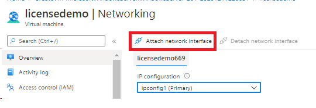
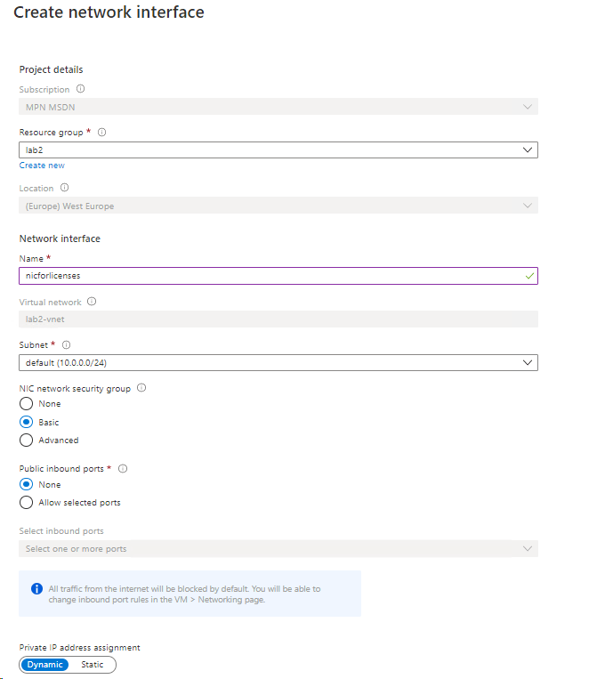
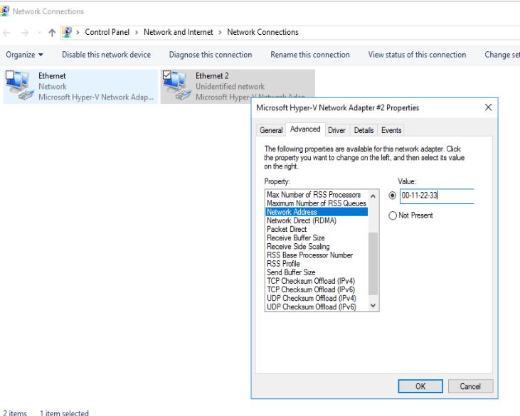

When you are undertaking a cloud migration, particularly a "lift and shift" of on-prem components you will likely come across some potential blockers or challenges. A good one I have come across is software tied to existing hardware.

For example, I have come across the scenario a few times whereby you have an application server with some software whose license is tied down to the mac address of the original machine it has been deployed to and it's often incredibly difficult to get this license changed!

In an on-prem environment you would possibly work around this when moving a virtual machine around by applying a static mac address in VMWare or Hyper-V at the hypervisor layer. However in Azure, you cannot manipulate this level of the networking stack, so what we can we do?

We can workaround this by attaching a "dummy" network interface to your virtual machine and applying the "old" mac address, which I will step through in the example below.

#### Example 

**1** - Head over to the Azure Portal to the virtual machine you wish to apply the static mac address for. To do this we first need to shutdown the virtual machine.

**2** - Now navigate to Settings > Networking and select Attach network interface, then create and attach interface

**3** - Enter a name for your additional network interface. Everything else you can either leave as default or if you want to isolate this network interface into a particular subnet go ahead and do so. We will not actually be routing any traffic over this interface once it's attached to the virtual machine, its purpose will only be to present a particular mac address.

**4** - Start your virtual machine back up and navigate to your network adapters in Control Panel

**5** - Right click and choose Properties for the network interface we've just added, choose Configure > Advanced and under Network Address set your static mac address then press OK.

  
  
If your application license is tied to a particular IP address you could also set this "old" IP on this dummy network card as the traffic will not find a route.

**6** - Now if you do an ipconfig /all from a command prompt or Powershell you should see your static mac address has been set for the 2nd network adapter.

--

I am taking part in the <a href="https://100daysofcloud.com/" target="_blank">#100DaysOfCloud Challenge</a>. Please do have a look at my <a href="https://github.com/rossinthecloud/100DaysOfCloud" target="_blank">Github journey tracker</a> to find out more, track my progress or get involved.

If you have any questions please also do reach out to me via a comment or on Twitter<a href="https://www.twitter.com/rossinthecloud" target="_blank"> @rossinthecloud</a>.

